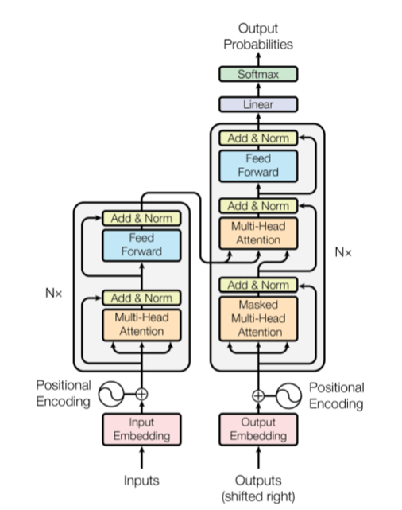

# IMDb-Movie-Review-Sentiment-analysis
This is a mini project, in which i designed the ROBERTA model with pytorch for sentiment analysis, and the dataset I used is IMDb-Movie-Review. The data contain raw text and its sentiment. 
## ROBERTA 
ROBERTA is a robustly optimized method for pretraining natural language processing (NLP) systems that improves on Bidirectional Encoder Representations from Transformers, or BERT, the self-supervised method released by Google in 2018. BERT is a revolutionary technique that achieved state-of-the-art results on a range of NLP tasks while relying on unannotated text drawn from the web, as opposed to a language corpus that’s been labeled specifically for a given task.

## Dataset
(https://www.cs.cornell.edu/people/pabo/movie-review-data/)

## Libraries Needed
- Transformers
- contractions
- torch
- sklearn
- numpy
- pandas
- nltk
- re
- glob
- os
- inspect
- Pytorch

## Project layout
- Load the Training data
- Data pre-processing and Data cleanning
- Exploratory data analysis
- Dataloader
- Model Creation
- Model Training
- Loss Function and Optimizer
- Save Model
- Model validation

## Description
In this work, I have done pre-processing including: stemming, stop words and punctuation removal. After that, I have performed some data analysis to analyse the data, then I designed the Roberta model class and custom data-class to transform the data into inputs-IDs, attention-mask and tokens types-IDs. After converting data into required format, I trained the model by using pretrained model (ROBERTa). Then, I performed the testing, and plotted Confusion matrix, The other evaluation criteria are shown as well.

Finally, all the code and relevant headings have been noted in the jupyter notebook for your understanding

